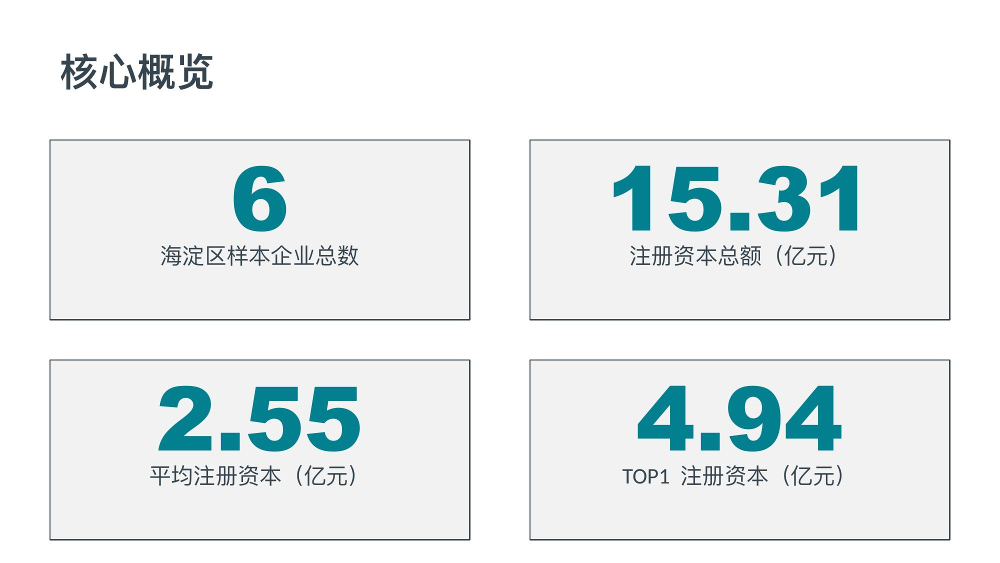
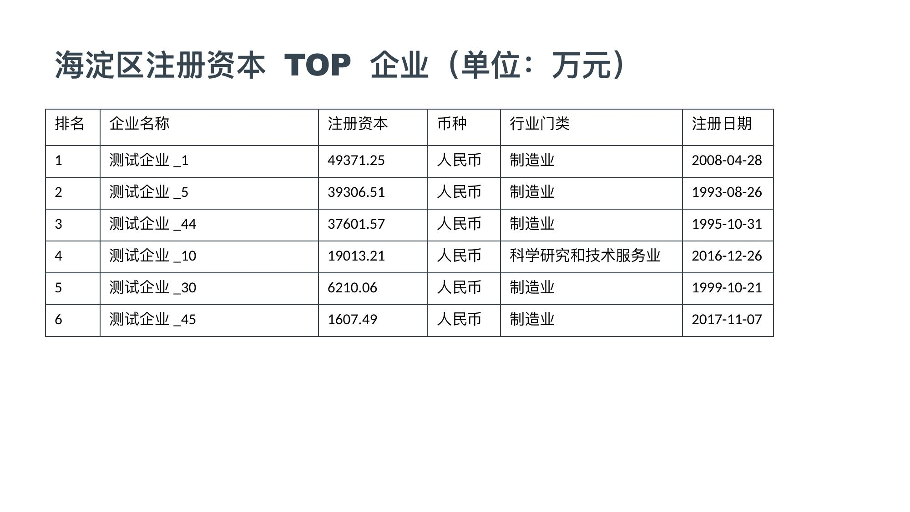
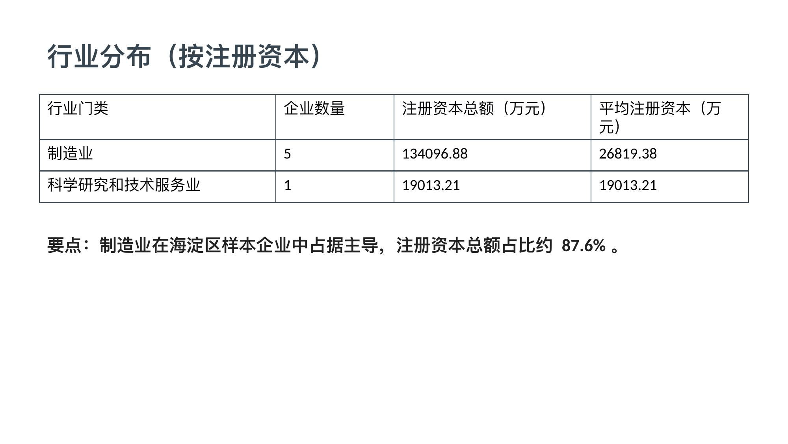
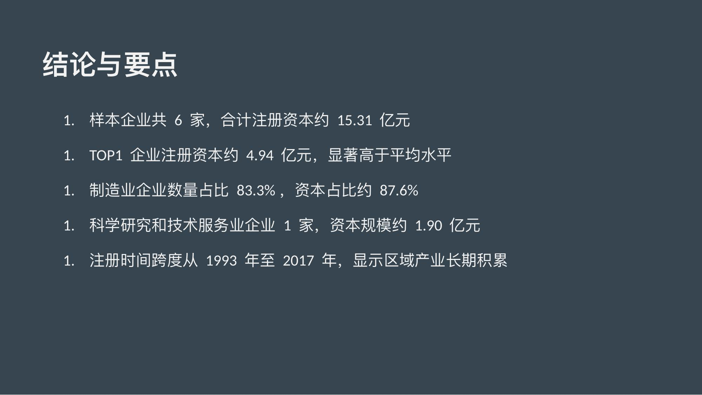

# 第 7 章 · 加一个做 PPT 的技能

**TL;DR**：给企业数据分析 Agent 挂上 Anthropic 官方的 `pptx` Skill 和三个内置工具，它就能根据查询结果自动编写 `pptxgenjs` 脚本、执行 `node`、生成一份配色不糟、数据真实、SQL 可追溯的 `.pptx`。`agent.yaml` 多 4 项配置，`system_prompt.md` 多一段，`bindings.py` 一行不动。

> **本章假设你**已经跟着第 1–6 章把企业数据分析 Agent 运行过。若尚未完成，请先回到[第 1 章](./01-bash-nl2sql.md)。

## 最终产出

完成本章后，智能体会具备两种工作模式：

- **Mode A**（默认）：问"注册地在海淀区的小型企业有多少家?"——返回一段自然语言 + SQL，与第 5 章完全一致
- **Mode B**：问"给我做一份海淀区 TOP 10 注册资本企业的简报 PPT"——智能体自行读取设计 Skill、查询数据、编写 JS、执行 `node`、最后告知 `output/haidian_top10.pptx` 已生成

切换依赖 prompt 中的几行描述，而非新代码。

## 第 6 章卡在哪

到第 6 章为止，智能体的输出始终是**一段文字 + 一段 SQL**。但业务方需要的并非如此，而是**一份可以直接发出的报告**：海淀区 TOP 10 简报、专精特新分布概览、季度融资榜的 PPT。

补充这部分能力，有两条路：

1. **手写一个 PPT 工具**：在 `bindings.py` 中维护模板和填槽逻辑——脆弱、难维护、每出一种新报告都要改代码
2. **教模型自行编写 PPT 代码**：给它一个 Skill 讲解如何使用 `pptxgenjs`、再给它几个能写文件和执行 shell 的内置工具

第二条路就是本章内容。**整章核心变更只有 `agent.yaml` 多 4 项配置、`system_prompt.md` 多一段、再补两份 tool schema 文件——`bindings.py` 一行不动。**

## 思路

NexAU 添加新能力时，取决于所需能力的类型：

- **加新工具**（第 2 章 `execute_sql`、第 4 章 `write_todos`）→ 让框架知道如何"执行新操作"
- **加新 Skill**（第 3 章每张表一个 SKILL.md）→ 让模型知道如何"使用已有的工具"

本章两者都需要：

| 加的东西 | 类型 | 作用 |
|---|---|---|
| `pptx` Skill （Anthropic 出品） | Skill | 教模型如何设计 PPT、如何使用 `pptxgenjs`、使用什么色板和字体 |
| `write_file` | NexAU 内置工具 | 让模型把生成的 JS 脚本写入磁盘 |
| `run_shell_command`（第 1 章已介绍） | NexAU 内置工具 | 执行 `node generate.js` 脚本 |
| `read_file` | NexAU 内置工具 | 让模型在需要时回读 `pptxgenjs.md` 子文档 |

模型最终的工作流是：**查数据 → 设计 PPT → 编写 JS → 执行 node → 报告文件路径**。

## 第 1 步：安装 Node.js + pptxgenjs

`pptxgenjs` 是 Node.js 库。若机器上尚未安装 Node：

- **macOS**:`brew install node`
- **Linux** （Debian / Ubuntu）：`sudo apt-get install nodejs npm`，或使用 [nvm](https://github.com/nvm-sh/nvm) 安装更新版本
- **Windows**:`winget install OpenJS.NodeJS`

安装完成后，在 `nexau-tutorial/` 下安装 `pptxgenjs`：

```bash
cd nexau-tutorial
npm init -y > /dev/null
npm install pptxgenjs
```

这会创建一个 `node_modules/`。本章的智能体会从 `nexau-tutorial/` 执行 `node`，因此脚本能直接 `require("pptxgenjs")`。

验证：

```bash
node -e "console.log(require('pptxgenjs').version)"
# 3.12.0 或更新
```

## 第 2 步：安装 pptx Skill

`pptx` 是 Anthropic 维护的官方 Skill，直接使用 `npx skills` 安装到全局：

```bash
npx skills add anthropics/skills@pptx -g -y
```

安装完成后，文件将存放于 `~/.agents/skills/pptx/`，其结构如下：

```
~/.agents/skills/pptx/
├── SKILL.md          # 入口:设计原则、色板、字体、QA workflow
├── pptxgenjs.md      # 完整的 pptxgenjs API 教程
├── editing.md        # 修改已有 .pptx 的 workflow
└── scripts/          # 配套的 Python 脚本(本章不用)
```

将该文件夹**复制**到智能体的 skills 目录：

```bash
# macOS / Linux
cp -r ~/.agents/skills/pptx enterprise_data_agent/skills/pptx
```

```powershell
# Windows PowerShell（Win10/11 默认自带，Copy-Item 相当于 cp -r）
Copy-Item -Recurse $HOME\.agents\skills\pptx enterprise_data_agent\skills\pptx
```

> **为什么用复制而非软链？** 软链接在打包发布（`tar`、zip、Docker 镜像）时容易变成空指针——打包工具不一定跟随符号链接。复制进项目目录后，Skill 文件随代码一起版本化、一起打包、一起部署，没有路径依赖。

验证：

```bash
ls enterprise_data_agent/skills/pptx
# 应该看到 SKILL.md  pptxgenjs.md  editing.md  scripts/
```

> **为什么 pptx Skill 这么大?** 第 3 章编写的 Skill 每个只有几十行 schema + 几条 example——那是**领域知识 Skill**。pptx Skill 不同，它是**领域工作流 Skill**：一整套"如何从零设计一份高质量 PPT"的方法论，包括 10 套预设色板、字体配对、布局类型、必须执行的 QA 步骤。Claude Skills 格式同时支持这两种用法，NexAU 的 Skill 加载器对它们一视同仁。

## 第 3 步：修改 `agent.yaml`

打开 `enterprise_data_agent/agent.yaml`，在 `tools:` 段加三个内置工具，在 `skills:` 段加 pptx：

```yaml
tools:
  - name: execute_sql
    yaml_path: ./tools/ExecuteSQL.tool.yaml
    binding: enterprise_data_agent.bindings:execute_sql

  - name: write_todos
    yaml_path: ./tools/TodoWrite.tool.yaml
    binding: nexau.archs.tool.builtin.session_tools:write_todos

  # 第 7 章新增:让智能体能把生成的 JS 脚本写入磁盘
  - name: write_file
    yaml_path: ./tools/WriteFile.tool.yaml
    binding: nexau.archs.tool.builtin.file_tools:write_file

  # 第 7 章新增:执行 node generate.js
  - name: run_shell_command
    yaml_path: ./tools/RunShellCommand.tool.yaml
    binding: nexau.archs.tool.builtin.shell_tools:run_shell_command

  # 第 7 章新增:让模型在需要细节时回读 pptxgenjs.md
  - name: read_file
    yaml_path: ./tools/ReadFile.tool.yaml
    binding: nexau.archs.tool.builtin.file_tools:read_file

skills:
  - ./skills/enterprise_basic
  - ./skills/enterprise_contact
  - ./skills/enterprise_financing
  - ./skills/enterprise_product
  - ./skills/industry
  - ./skills/industry_enterprise
  - ./skills/users

  # 第 7 章新增
  - ./skills/pptx
```

`write_file`、`read_file`、`run_shell_command` 三个工具均复用 NexAU 内置实现（`binding` 指向 `nexau.archs.tool.builtin.*`），各自需要一份 schema 文件。`RunShellCommand.tool.yaml` 第 1 章已写好（若已在第 2 章清理掉，按第 1 章内容重新创建即可），这里补上另外两个。

创建 `enterprise_data_agent/tools/WriteFile.tool.yaml`：

```yaml
type: tool
name: write_file
description: >-
  Write text content to a file on disk. Creates the file (and any missing
  parent directories) if it does not exist; overwrites if it does.

input_schema:
  type: object
  properties:
    file_path:
      type: string
      description: Relative or absolute file path to write to.
    content:
      type: string
      description: The text content to write.
  required: [file_path, content]
  additionalProperties: false
  $schema: http://json-schema.org/draft-07/schema#
```

创建 `enterprise_data_agent/tools/ReadFile.tool.yaml`：

```yaml
type: tool
name: read_file
description: >-
  Read the text content of a file on disk.

input_schema:
  type: object
  properties:
    file_path:
      type: string
      description: Relative or absolute file path to read.
  required: [file_path]
  additionalProperties: false
  $schema: http://json-schema.org/draft-07/schema#
```

pptx Skill 提供的是工作流知识而非数据库知识，但 NexAU 不区分，挂到 `skills:` 即可。

## 第 4 步：修改 system prompt

模型现在多了一种"完成方式"：除了"回答问题"，还能"产出一份 PPT"。需要在 system prompt 中告知它何时选用哪种模式。打开 `enterprise_data_agent/system_prompt.md`，在 Workflow 段后面加一段 Output Modes：

```markdown
## Output Modes

You have two ways to deliver an answer. **Pick based on what the user asks for**, not on your own preference.

### Mode A — Plain answer (default)

When the user asks a question and just wants the answer, reply in chat:
- A short, natural-language answer grounded in the actual rows
- The SQL you ran in a fenced block

This is the default. Use it unless the user explicitly asks for a deck, slides, presentation, report file, or `.pptx`.

### Mode B — Generate a `.pptx`

When the user asks for a "PPT", "deck", "slides", "presentation", "汇报", "简报", or "报告文件":

1. **Read the `pptx` skill first.** Always. It contains design rules, color palettes, and the `pptxgenjs` API. Your first instinct on layout and color will be wrong — read it.
2. **Query the data** with `execute_sql`. Get *all* the rows you need before writing any JS.
3. **Plan slide-by-slide.** A good data analysis deck is 4–8 slides:
   - Title slide (topic + date)
   - 1–2 slides of headline numbers (large stat callouts)
   - 1–3 slides of breakdowns (top-N tables, comparisons)
   - Summary / takeaways slide
4. **Pick a color palette from the pptx skill** that matches the topic. Don't default to blue.
5. **Write a JS script** with `pptxgenjs` and save it via `write_file` to `output/<topic>.js`. The script should `require("pptxgenjs")`, build the slides, and call `pres.writeFile({ fileName: "output/<topic>.pptx" })`.
6. **Run it** with `run_shell_command`: `node output/<topic>.js`. The cwd is `nexau-tutorial/`, so `require("pptxgenjs")` resolves through the local `node_modules`.
7. **Reply** with the file path and a one-line summary of what's in the deck. End with the SQL you ran.

### Hard rules for PPT generation

- **Numbers come from `execute_sql` only.** Never make up data. If a query returns 0 rows, say so and stop — don't fill the slide with placeholders.
- **No charts in v1.** `pptxgenjs` supports charts but they're easy to get wrong. Use big stat callouts and tables.
- **Output goes under `output/`.** Create the folder if it doesn't exist (`mkdir -p output` via `run_shell_command`).
```

与前面几章一样，整个 prompt 的其它段（Workflow、Constraints）保持不变，仅新增一个 Output Modes 段。

## 运行

先确认修改 prompt 未影响原有功能：

```bash
uv run enterprise_data_agent/start.py "注册地在海淀区的小型企业有多少家?"
```

应与第 5 章一致，纯文字回答，不会生成 PPT。这是 Mode A。

现在尝试 Mode B：

```bash
uv run enterprise_data_agent/start.py "给我做一份海淀区 TOP 10 注册资本企业的简报 PPT"
```

观察 trace，可以看到大致如下的事件序列：

1. `read_skill(name="pptx")` —— 读取 pptx Skill 的 SKILL.md
2. `read_skill(name="enterprise_basic")` —— 读取企业基本信息表的 Skill，查看 `register_capital` 列的注意事项
3. `execute_sql(sql="SELECT enterprise_name, CAST(register_capital AS REAL) AS cap FROM enterprise_basic WHERE register_district = '海淀区' ORDER BY cap DESC LIMIT 10")`
4. （可能）`read_file(file_path="enterprise_data_agent/skills/pptx/pptxgenjs.md")` —— 对某个 API 不确定时回读子文档
5. `run_shell_command(command="mkdir -p output")`
6. `write_file(file_path="output/haidian_top10.js", content="const pptxgen = require('pptxgenjs'); ...")`
7. `run_shell_command(command="node output/haidian_top10.js")`
8. 最终回复："`output/haidian_top10.pptx` 已生成，共 5 页：封面、TOP 3 大数字、TOP 4–10 表格、行业分布、总结。"

打开 `nexau-tutorial/output/haidian_top10.pptx`（macOS 使用 `open output/haidian_top10.pptx`、Linux 使用 `xdg-open`、Windows 双击），应该能看到一份配色不糟、数据真实、SQL 可追溯的 PPT。

下面是智能体生成的 PPT 实际效果（5 页）：










再尝试一个跨表的场景：

```bash
uv run enterprise_data_agent/start.py "给我做一份各专精特新等级企业数量 + 主营行业分布的简报"
```

这一次模型会：
- 读取 `enterprise_basic` Skill（了解 `zhuanjingtexin_level` 列）
- 读取 `industry` + `industry_enterprise` Skill（了解如何 join 行业链）
- 调用多次 `execute_sql` 获取不同维度的数据
- 使用 `write_todos` 将"3 个查询 + 1 个 PPT 生成"拆成 4 步追踪
- 生成一份多页 PPT

**前 6 章建好的所有能力都派上了用场**——结构化工具、Skills、规划、长输出截断、跨 Provider——pptx 只是又一个 Skill，叠加在已有的技术栈上。

## 本版成果

| 概念 | 在本章中的体现 |
|---|---|
| Skill 不止能承载领域知识 | pptx 承载的是"领域工作流"——一整套设计 PPT 的方法论 |
| 第三方 Skill 可直接复用 | Anthropic 的 pptx Skill 通过 `cp -r` 复制进项目即可接入智能体 |
| 内置工具的组合表达力 | `write_file` + `run_shell_command` 几乎能完成任何"生成 + 执行"型任务 |
| 一个智能体可以有多种输出模式 | 同一个 `agent.yaml` 既能回答问题也能生成文件，依靠 prompt 中的 Output Modes 路由 |

**渐进检查表**：

| | 第 5 章 | 第 7 章 |
|---|---|---|
| `agent.yaml` `tools:` | 2 个 | **+3 个内置工具（read_file / write_file / run_shell_command）** |
| `agent.yaml` `skills:` | 7 个 | **+1 个 pptx** |
| `bindings.py` | ~260 行 | **未改动** |
| `tools/*.tool.yaml` | 2 个 | **+3 个（ReadFile / WriteFile / RunShellCommand）** |
| `system_prompt.md` | 6 步 Workflow | **+1 段 Output Modes** |
| 新增依赖 | —— | Node.js + `pptxgenjs` |

智能体的全部 PPT 生成能力都来自模型自行读取 pptx Skill 后编写的 JS 代码——无需维护任何 PPT 模板。

## 局限与权衡

运行几次之后，几个真实的痛点会浮现出来。这里将它们逐一说明，而非假装本章交付了一个完美方案。

**没有图表。** 我们在 Hard rules 中禁用了 `pptxgenjs` 的 chart API。首次实验时启用它，模型大概率会把数据维度搞错——例如把日期排成 Y 轴、把企业名排成图例。要让图表稳定，通常的做法是：让 Python（matplotlib / plotly）在 `execute_sql` 之外另起一个工具生成 PNG，再让 JS 用 `slide.addImage()` 嵌入。这条路本章未实现，留作扩展。

**设计同质化。** pptx Skill 提供了 10 套色板，但模型在缺乏具体引导时倾向于选择前几套。若需为客户制作正式汇报，在 prompt 中指定"使用 Midnight Executive 色板"或"使用公司主色 #xxxxxx"会更稳定。

**视觉 QA 未自动化。** pptx Skill 的 SKILL.md 末尾有一整套"渲染成图 → 用子智能体审查找 bug"的 QA workflow。本章未搭建该管道（需要 LibreOffice + Poppler + 子智能体调度）。若要将此智能体部署到生产环境供终端用户使用，接入 QA loop 是必要的——这恰好是 NexAU 子智能体的典型用例。

**单文件输出，不支持模板。** 我们采用的是 pptx Skill 的"从零创建"路径（`pptxgenjs`）。若已有公司模板 `.pptx` 文件，需要将数据填入其中，应采用另一条路径——`editing.md` 中介绍的 `python-pptx` + 模板 unpack/pack。同一个 pptx Skill 已经覆盖了这条路径，只是本章未使用。

## 完整的 0 → 1 教程到此结束

你已经从一个"能执行一次 SQL 的 shell 智能体"一路构建到了"能基于 7 张表的真实数据自动生成简报 PPT 的多模态智能体"。回顾编写过的代码：

```
enterprise_data_agent/
├── agent.yaml             # ~60 行: llm + tools + skills + middlewares
├── system_prompt.md       # 6 步 Workflow + Output Modes
├── bindings.py            # ~260 行: execute_sql + 安全护栏
├── tools/
│   ├── ExecuteSQL.tool.yaml
│   ├── TodoWrite.tool.yaml
│   ├── WriteFile.tool.yaml          # 第 7 章新增
│   ├── ReadFile.tool.yaml           # 第 7 章新增
│   └── RunShellCommand.tool.yaml    # 第 1 章创建,第 7 章重新启用
└── skills/
    ├── enterprise_*/
    ├── industry*/
    ├── users/
    └── pptx/                        # cp -r 复制进来的真实目录
```

真正需要手写的 Python 只有一个 `bindings.py`（~260 行），其余全是声明式的 YAML 和 Markdown。7 章下来：

- **结构化、安全的工具**（第 2 章）
- **领域知识按需加载**（第 3 章）
- **多步任务规划**（第 4 章）
- **超长输出截断**（第 5 章）
- **跨四种 LLM 协议**（第 6 章）
- **多输出模式 + 第三方 Skill 复用**（第 7 章）

剩下的工作不再是"框架问题"，而是**产品问题**——迭代 Skill、为特定客户调整色板、接入 tracing、将智能体部署到真正的 UI 后面。框架的职责已经完成。

## 延伸阅读

- [Anthropic Skills 仓库](https://github.com/anthropics/skills) —— pptx 之外还有 docx、xlsx、pdf 等官方 Skill，接入方式与本章相同
- [pptxgenjs 官方文档](https://gitbrent.github.io/PptxGenJS/) —— 若需启用 chart API，可从此处查阅
- [第 3 章 · 写自己的 Skill](./03-skills.md) —— 若要为自己的业务领域编写工作流 Skill，可从该章的格式起步
