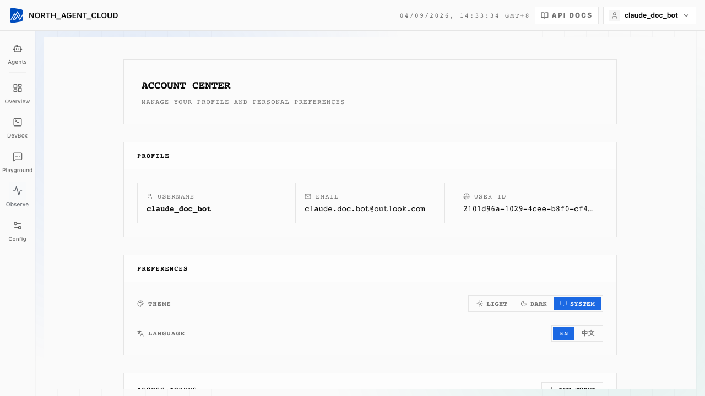
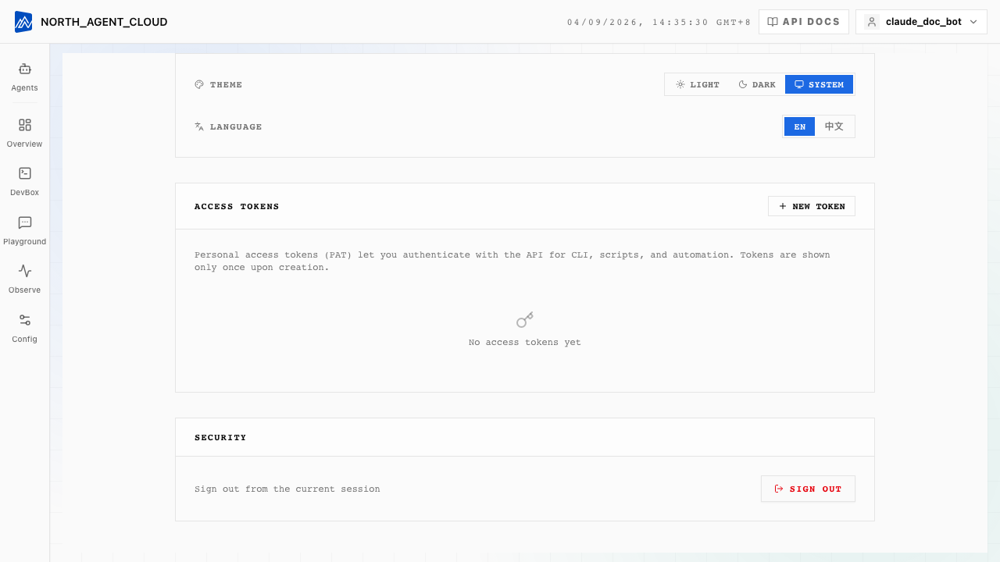

# 第 10 章 · 用 REST 自动化发版

**TL;DR**：建一个 **Personal Access Token**（PAT），用它走 Backend API 的几个端点——建版本、获取预签名 URL（presigned URL，服务端生成的一次性上传地址，客户端无需额外认证即可直接 PUT 文件）、PUT 直传 zip 包、激活。整套发版流程一段 200 行 Python 或一段 GitHub Actions yaml 即可完成。

> **本章假设**你已经走完第 8 章——有 project、有 project_id、知道怎么手动发一个 version。若尚未完成，请先回到[第 8 章](./08-deploy-cloud.md)。

## 最终成果

1. **`scripts/deploy.py`**：接受 project_id、tag 和一个 zip 文件路径，完成"建 version → 获取 URL → 上传 → confirm → activate"五步
2. **`.github/workflows/deploy.yml`**：监听 main 分支的 push，执行 `zip` + `python scripts/deploy.py`，打一个 `vYYYY.MM.DD-<sha>` 的版本标签
3. **无需再打开浏览器拖文件**：`git push` 两分钟后，同事就能在 Playground 看到新版本

从改完 prompt 到用户能用上，**一次 push 即可完成**。

## 思路：两种 Key，两个用途

第 8、9 章用的 **AK/SK** 绑 project，只能"调这个 project 的 active version"。它**不能建 project、改 version、改 env vars**——这些是 control plane 操作，需要"用户身份"，AK/SK 是"项目身份"。

control plane 的认证有两种：

| 认证方式 | 使用者 | 获取方式 | 使用方式 |
|---|---|---|---|
| **JWT Cookie**（HttpOnly） | 浏览器里的 Cloud 控制台 | 邮箱密码登录后自动种 cookie | 浏览器自动带，无需手动处理 |
| **Personal Access Token （PAT）** | CLI、CI、脚本、webhook | 控制台 → Settings → Tokens → Create | `Authorization: Bearer <token>` |

**PAT 是这一章的主角。** 它是 **user-scoped**——绑定到你这个用户，作用范围等同于你登录浏览器（UI 上能做的任何 control plane 操作，PAT 都能做）。所以它**比 AK/SK 危险**：AK/SK 顶多调一个 project，PAT 能改你账号下所有 project 的代码、env vars，甚至删 project。

> **PAT 必须存进 secret store**（GitHub Actions Secrets、Vault、AWS Secrets Manager 之类），**绝对不能 commit 进仓库**。下面的代码都假设它从环境变量读。

## 第 1 步：建一个 PAT

点右上角用户菜单进入 **Account Center**：



往下滚到 **Access Tokens** 卡片，点 **+ New Token**：



在弹出的对话框里填写：

| 字段 | 填写内容 |
|---|---|
| **Name** | `github-actions-deploy`（供自身辨识，吊销时按名字查找） |
| **Expires in** | `90d`（推荐）或 `null`（永不过期，**不推荐**） |

> **过期时间一定要设。** 永不过期的 token 泄漏后无法自动止损，只能等手动 revoke。90 天是个折中——三个月轮换一次。

提交后显示完整 token：

```
NEXAU_PAT=nau_pat_01HXXXXXXXXXXXXXXXXXXXXXXXXX
```

**只显示一次。** 复制后存入 GitHub Actions Secrets（或 CI 的等价物），关掉对话框就无法再查看。

> 这一步的 API 是 `POST /api/auth/tokens`。从代码里自动创建 PAT 亦可实现（用自己的 JWT cookie 或另一个 PAT 调它），但 99% 的场景手动建一次即可。

## 第 2 步：发版用到的端点

发版流程是 **Backend API 的几个 REST 端点**，全部用 `Authorization: Bearer <pat>` 认证：

| 步骤 | 方法 | 路径 | 用途 |
|---|---|---|---|
| 1 | `POST` | `/api/projects/{project_id}/versions` | 建一个空 version，返回 `version_id` |
| 2 | `POST` | `/api/projects/{project_id}/versions/{version_id}/artifact/upload-url` | 获取一个预签名上传 URL |
| 3 | `PUT` | `<上一步返回的 URL>` | 把 zip 包直传到对象存储 |
| 4 | `POST` | `/api/projects/{project_id}/versions/{version_id}/artifact/confirm` | 告诉后端"传输完毕，请校验" |
| 5 | `PUT` | `/api/projects/{project_id}/versions/{version_id}/activate` | 激活这个 version |

第 3 步**直传对象存储**，不走 Backend 转发——包大几百 MB 也没事。

> **`needs_confirm` 字段。** 第 2 步返回的 JSON 里有 `needs_confirm: bool`。某些部署模式（Backend 用了 proxy upload endpoint 而不是真正的预签名 URL）会让 `needs_confirm = false`，这时第 4 步是 noop。代码里要判断这个字段，不要盲目调 confirm。

## 第 3 步：把它写成 Python

```python
# scripts/deploy.py
import os
import sys
import requests
from pathlib import Path

API_BASE = os.environ["NEXAU_API_BASE"]    # 例如 https://api.nexau.example
PAT = os.environ["NEXAU_PAT"]
HEADERS = {"Authorization": f"Bearer {PAT}"}


def create_version(project_id: str, tag: str) -> str:
    """Step 1: create an empty version, return version_id."""
    resp = requests.post(
        f"{API_BASE}/api/projects/{project_id}/versions",
        headers={**HEADERS, "Content-Type": "application/json"},
        json={"tag": tag},
        timeout=30,
    )
    resp.raise_for_status()
    return resp.json()["id"]


def get_upload_url(project_id: str, version_id: str, content_length: int) -> dict:
    """Step 2: get presigned upload URL."""
    resp = requests.post(
        f"{API_BASE}/api/projects/{project_id}/versions/{version_id}/artifact/upload-url",
        headers={**HEADERS, "Content-Type": "application/json"},
        json={
            "content_type": "application/zip",
            "content_length": content_length,
        },
        timeout=30,
    )
    resp.raise_for_status()
    return resp.json()


def upload_artifact(upload_info: dict, file_path: Path) -> None:
    """Step 3: PUT the zip to the presigned URL."""
    url = upload_info["upload_url"]
    headers = upload_info.get("upload_headers") or {}

    # 相对 URL 表示走 Backend proxy 上传(不是真正的 S3 预签名),拼一个完整 URL
    if url.startswith("/"):
        url = f"{API_BASE}{url}"

    with file_path.open("rb") as f:
        resp = requests.put(url, data=f, headers=headers, timeout=600)
    resp.raise_for_status()


def confirm_upload(project_id: str, version_id: str, bundle_size: int) -> None:
    """Step 4: confirm upload (only if needs_confirm)."""
    resp = requests.post(
        f"{API_BASE}/api/projects/{project_id}/versions/{version_id}/artifact/confirm",
        headers={**HEADERS, "Content-Type": "application/json"},
        json={"bundle_size": bundle_size},
        timeout=30,
    )
    resp.raise_for_status()


def activate_version(project_id: str, version_id: str) -> None:
    """Step 5: activate."""
    resp = requests.put(
        f"{API_BASE}/api/projects/{project_id}/versions/{version_id}/activate",
        headers=HEADERS,
        timeout=30,
    )
    resp.raise_for_status()


def deploy(project_id: str, tag: str, file_path: Path) -> str:
    size = file_path.stat().st_size

    print(f"[1/5] creating version {tag}…")
    version_id = create_version(project_id, tag)
    print(f"      → version_id={version_id}")

    print(f"[2/5] requesting upload URL…")
    upload_info = get_upload_url(project_id, version_id, size)

    print(f"[3/5] uploading {size:,} bytes…")
    upload_artifact(upload_info, file_path)

    if upload_info.get("needs_confirm"):
        print(f"[4/5] confirming upload…")
        confirm_upload(project_id, version_id, size)
    else:
        print(f"[4/5] confirm skipped (proxy upload mode)")

    print(f"[5/5] activating…")
    activate_version(project_id, version_id)

    print(f"\n✓ deployed {tag} → version_id={version_id}")
    return version_id


if __name__ == "__main__":
    if len(sys.argv) != 4:
        print("用法: python scripts/deploy.py <project_id> <tag> <zip_file>", file=sys.stderr)
        sys.exit(1)

    deploy(sys.argv[1], sys.argv[2], Path(sys.argv[3]))
```

运行一次：

```bash
export NEXAU_API_BASE="https://api.nexau.example"
export NEXAU_PAT="nau_pat_xxxxxxxx"

cd nexau-tutorial
zip -r enterprise_data_agent.zip \
    enterprise_data_agent \
    enterprise.sqlite \
    -x "enterprise_data_agent/__pycache__/*" \
       "enterprise_data_agent/.venv/*" \
       "enterprise_data_agent/output/*"

python scripts/deploy.py "<your-project-id>" "v1.0.5" enterprise_data_agent.zip
```

输出格式大致如下：

```
[1/5] creating version v1.0.5…
      → version_id=01HXX...
[2/5] requesting upload URL…
[3/5] uploading 4,237,891 bytes…
[4/5] confirming upload…
[5/5] activating…

✓ deployed v1.0.5 → version_id=01HXX...
```

通常 5–15 秒，主要时间在打 zip 和上传。

## 第 4 步：接进 GitHub Actions

把这段加入 `.github/workflows/deploy-agent.yml`：

```yaml
name: Deploy enterprise_data_agent to NexAU Cloud

on:
  push:
    branches: [main]
    paths:
      - 'enterprise_data_agent/**'
      - 'enterprise.sqlite'
      - '.github/workflows/deploy-agent.yml'

jobs:
  deploy:
    runs-on: ubuntu-latest
    steps:
      - uses: actions/checkout@v4

      - uses: actions/setup-python@v5
        with:
          python-version: '3.11'

      - name: Install requests
        run: pip install requests

      - name: Compute version tag
        id: tag
        run: |
          DATE=$(date +%Y.%m.%d)
          SHORT_SHA=${GITHUB_SHA::7}
          echo "tag=v${DATE}-${SHORT_SHA}" >> "$GITHUB_OUTPUT"

      - name: Pack agent bundle
        run: |
          zip -r enterprise_data_agent.zip \
              enterprise_data_agent \
              enterprise.sqlite \
              -x "enterprise_data_agent/__pycache__/*" \
                 "enterprise_data_agent/.venv/*" \
                 "enterprise_data_agent/output/*"

      - name: Deploy to NexAU Cloud
        env:
          NEXAU_API_BASE: ${{ secrets.NEXAU_API_BASE }}
          NEXAU_PAT: ${{ secrets.NEXAU_PAT }}
          PROJECT_ID: ${{ secrets.NEXAU_PROJECT_ID }}
        run: |
          python scripts/deploy.py "$PROJECT_ID" "${{ steps.tag.outputs.tag }}" enterprise_data_agent.zip
```

在 GitHub repo 的 **Settings → Secrets → Actions** 加三个 secret：

| Secret | 值 |
|---|---|
| `NEXAU_API_BASE` | `https://api.nexau.example` |
| `NEXAU_PAT` | 刚才建的 token |
| `NEXAU_PROJECT_ID` | 第 8 章记下来的 project UUID |

之后每次 push 到 main 分支，只要改动了 `enterprise_data_agent/` 下的文件，就会自动发一个新版本。**版本号是日期 + git short sha**（比如 `v2026.04.08-a3f9c12`），按日期排序也能跟具体 commit 对上。

## 第 5 步：管理 env vars

发版只是一面，生产里还有"配置"——数据库连接串、第三方 API key、feature flag——这些不该加入代码包。Cloud 的做法是 **project-level environment variables**，通过另一组 REST 端点管理：

| 方法 | 路径 | 用途 |
|---|---|---|
| `GET` | `/api/projects/{id}/env-vars` | 列出所有 env var（secret 的 value 会被脱敏） |
| `POST` | `/api/projects/{id}/env-vars` | 新增一条 |
| `PUT` | `/api/projects/{id}/env-vars` | **整个替换**（注意是覆盖，不是合并） |
| `DELETE` | `/api/projects/{id}/env-vars/{key}` | 按 key 删一条 |

POST 请求体：

```json
{
  "key": "OPENAI_API_KEY",
  "value": "sk-xxxxxxxx",
  "is_secret": true
}
```

`is_secret: true` 的 var 在 UI 上 value 会被打码，`GET` 也只能得到打码版——读真值只能从运行时的 `os.environ["OPENAI_API_KEY"]` 读。

> **批量更新用 `PUT` 要小心。** Backend 的语义是**整个替换**——PUT 一个只有两条的列表，其它现有 env var **会被删掉**。批量同步前先 GET 一份，在内存里 merge，再 PUT 回去。

常见做法是把环境变量也接进 CI：repo 里维护一份 `env-vars.yml`，workflow 在 deploy 前先 sync 到 Cloud。具体写法不展开了，逻辑跟 `deploy.py` 一样。

## 这一版给了你什么

| 概念 | 在这一章里的体现 |
|---|---|
| 控制平面 = REST | "改东西"的所有操作都在 `/api/*`，认证用 PAT，curl 即可调用 |
| PAT 是 user-scoped | 它能做你登录浏览器能做的任何事——比 AK/SK 危险得多，**必须放 secret store + 设过期** |
| 三步上传是直传 | zip 包大也没事，Backend 不当中转 |
| Activation 是单独一步 | 上传成功 ≠ 激活——upload 和 activate 解耦，你可以"先传几个版本备用，需要哪个再激活哪个"，支持冷备和回滚 |
| 发版幂等 | 用日期+sha 当 tag 之后，同一个 commit 重发会因为 tag 冲突直接失败，不会发出两个一样的版本 |

**渐进检查表**：

| | 第 8 章 | 第 10 章 |
|---|---|---|
| 怎么建 project | UI 点击 | UI 点击（一次性，后面不变了） |
| 怎么发 version | UI 拖文件 | `git push` 自动触发 |
| 用什么 token | —— | PAT（user-scoped） |
| 怎么改 env var | —— | `PUT /api/projects/{id}/env-vars` |
| 跟代码版本怎么关联 | 手填 tag | `vYYYY.MM.DD-<sha>` 自动生成 |

## 局限与权衡

**没有 dry-run。** Backend 没有"假装发一版检查 agent.yaml 是否正确"的端点。只能完整执行一遍"create → upload → confirm"，错误在解 bundle 时才抛出来。**每次试错都会留一个 inactive version 在数据库里**——积累多了会很混乱。CI 里建议加一步：activate 失败就主动调 `DELETE /api/projects/{id}/versions/{vid}` 把这次的废弃版本清掉。

**Activate 不是事务性的。** `PUT /activate` 返回 200 **理论上**就生效了，但传播到所有 gateway 节点有几秒延迟。CI 里 activate 后 sleep 5–10 秒，再调一次 Gateway 的 `/agent-api/chat` 发一个"hello"做 smoke test（冒烟测试，部署后发一个最简请求验证服务是否正常响应），失败就用 `/activate` 切回上一个版本。

**tag 不能复用。** 同 project 下 tag 是 unique constraint，第二次发 `v1.0.0` 直接 409。这是个好特性（避免误覆盖）——但 CI 里 tag 生成策略要注意，不能因为 retry 就撞 tag。日期+sha 的方案就是为了让同一个 commit 在同一天 retry 不撞。

**PAT 没有细粒度作用域。** 一个 PAT 等于"我这个用户的全部权限"。要"只能发 enterprise_data_agent 项目"的最小权限 PAT，目前（写本章时）做不到——只能在团队里用单独的 service account 用户登录，在那个用户下建 PAT。目前暂未支持。

## 完整教程到这儿就结束了

回头看十章做过的事：

```
第 1–6 章: 在 shell 里建一个能查数据的智能体,跨四种 LLM 协议
第 7 章:    给它加一个 PPT 生成技能
第 8 章:    手动部署到 NexAU Cloud
第 9 章:    从外部代码用 REST 调它
第 10 章:   发版完全自动化,接进 CI/CD
```

这是一条**完整的 0→1 路径**：从"在终端里 print 一个查询结果"到"一个有版本管理、有 trace、有 CI/CD、能被任何系统调用的产品"。剩下的都是产品迭代——加 Skill、改 prompt、给特定客户调色板——不再需要理解 NexAU 的内部机制。

## 延伸阅读

- [第 8 章 · 部署到 NexAU Cloud](./08-deploy-cloud.md) —— 获取 project_id 的地方
- [第 9 章 · 从外部 REST 调用 Cloud Agent](./09-cloud-api.md) —— 跟这一章对照看，理解控制平面 vs 数据平面的分工
