# 第 7 章 · 部署到 NexAU Cloud

**TL;DR**：将前 6 章的 `enterprise_data_agent/` 打成压缩包，在 NexAU Cloud 控制台**新建项目 → 上传版本 → 激活**，获得一个云端 Playground 和一对 API Key。他人无需安装 Python、uv、sqlite、Node 即可使用该智能体，零新代码。

> **没有从头做？** 如果你还没有跟完第 1–6 章，可以直接下载现成的制品包：<a href="/enterprise_data_agent.zip" download>enterprise_data_agent.zip</a>。下载后直接上传到 Cloud 即可，不需要解压。

## 为什么要上云

本地开发很顺手，但有三件事本地无法解决：

1. **别人用不了。** 同事使用前需先安装 Python / uv / sqlite / Node、配置 API Key、克隆项目。一次尚可，十次便令人疲于应付。
2. **没有 trace UI。** 终端只能逐行查看 log。查阅 trace、对比两个 run、按工具调用筛选——手动操作效率极低。
3. **没有版本管理。** 改完一版 system prompt 想跟昨天那版对比，本地没有回滚机制。

Cloud 提供的是 **托管运行时 + Trace UI + 版本快照**。打包一次，获得一个稳定的 Playground 链接和一对 API Key——之后改 prompt、换 provider，**项目本身不动**。

## 最终成果

- Cloud 上的一个 **Project**，名字叫 `enterprise_data_agent`
- 一个激活的 **Version**（`v1.0.0`），所有调用都打到它
- 一个**云端 Playground 链接**，发给同事就能问"注册地在海淀区的小型企业有多少家?"
- 一对 **Access Key + Secret Key**，从代码里调这个智能体

云上运行的是**同一份 `agent.yaml` + `system_prompt.md` + `tools/execute_sql.py` + `skills/`**。运行时镜像里预装了第 6 章用到的 Node + `pptxgenjs`。

## 思路

NexAU Cloud 的部署模型是**项目（Project） → 版本（Version） → 激活（Activate）**：

| 概念 | 对应本地的什么 |
|---|---|
| **Project** | 一个智能体的"名字空间"。`enterprise_data_agent` 是一个 project，以后再写一个 `customer_support_agent` 就是另一个 |
| **Version** | 一次打包上传的快照。改 prompt 或 binding 就发一个新 Version，旧的可回滚 |
| **Activate** | 把某个 Version 设为"当前生效的"。Playground 链接和 API Key 永远打到这个激活版本 |

**没有 git push、没有 CI**——就是在控制台上拖一个 `.zip`。

## 第 1 步：创建 `nexau.json`

Cloud 运行时解压制品后，需要知道"哪个文件是 agent 入口"。这个信息写在 `enterprise_data_agent/nexau.json` 中——没有它，激活会直接 502。

在 `enterprise_data_agent/` 下创建 `nexau.json`：

```json
{
  "agents": {
    "enterprise_data_agent": "agent.yaml"
  },
  "excluded": [
    ".nexau/",
    ".env",
    "__pycache__/"
  ]
}
```

| 字段 | 含义 |
|---|---|
| `agents` | 键是 agent 名称（与 `agent.yaml` 中的 `name` 一致），值是配置文件的相对路径 |
| `excluded` | Cloud 运行时忽略的目录/文件，避免加载 `.env`（含 API Key）和缓存文件 |

> **本地运行不需要这个文件。** `start.py` 直接读 `agent.yaml`，不经过 `nexau.json`。这个文件只在 Cloud 上有意义。

## 第 2 步：打包项目

回到 `nexau-tutorial/`，把 `enterprise_data_agent/` 和教程用到的示例数据库一起打成一个 `.zip`：

```bash
cd nexau-tutorial

# Cloud 运行时里 tools/execute_sql.py 通过
#   Path(__file__).parent.parent / "enterprise.sqlite"
# 找数据库——也就是 enterprise_data_agent/ 目录下。
# 所以要先把 sqlite 拷一份进去再打包。
cp enterprise.sqlite enterprise_data_agent/enterprise.sqlite

zip -r enterprise_data_agent-v1.0.0.zip \
    enterprise_data_agent \
    enterprise.sqlite \
    -x "enterprise_data_agent/skills/pptx/scripts/office/schemas/*" \
       "enterprise_data_agent/__pycache__/*" \
       "enterprise_data_agent/.venv/*" \
       "enterprise_data_agent/output/*" \
       "*.pyc" "*/.DS_Store"

# 打完包删掉拷进去的副本，保持仓库干净
rm enterprise_data_agent/enterprise.sqlite
```

> **Cloud 只接受 `.zip`**。tar / tar.gz 会被拒绝，解包器写的是 zip。macOS / Linux / Windows 都自带 `zip` 命令，直接用即可。

验证包中是否包含所需文件：

```bash
unzip -l enterprise_data_agent-v1.0.0.zip | head -20
```

至少应该看到：

```
enterprise_data_agent/
enterprise_data_agent/agent.yaml
enterprise_data_agent/system_prompt.md
enterprise_data_agent/tools/execute_sql.py
enterprise_data_agent/tools/ExecuteSQL.tool.yaml
enterprise_data_agent/tools/TodoWrite.tool.yaml
enterprise_data_agent/skills/enterprise_basic/SKILL.md
enterprise_data_agent/enterprise.sqlite   ← Cloud 运行时需要
enterprise.sqlite
...
```

**常见踩坑**：

- **`agent.yaml` 中的 `api_type` 必须写死，不能用 `${env.LLM_API_TYPE}`。** 本地开发时 `start.py` 会通过 `load_dotenv(.env)` 注入 `LLM_API_TYPE`，但 Cloud 只自动注入三个 LLM 变量：`LLM_MODEL`、`LLM_BASE_URL`、`LLM_API_KEY`——没有 `LLM_API_TYPE`。若 `agent.yaml` 里写了 `api_type: ${env.LLM_API_TYPE}`，Cloud 运行时解析为空字符串，LLM 客户端初始化直接报错，表现为 `RUNTIME_BAD_RESPONSE / Agent Runtime failed to start`。修复方法：把它改成 `api_type: openai_chat_completion`（Cloud 的 North Gate 就是 OpenAI 兼容协议）。
- **`tool_call_mode` 使用 `structured`。** NexAU 会根据 `api_type` 自动将工具 schema 翻译成 Provider 对应的 function calling 格式，Cloud 上同样适用。`openai` 是旧版兼容别名，运行时会产生迁移警告。
- **自定义工具的 binding 路径要用 `tools.<module>:<function>` 格式。** 例如 `binding: tools.execute_sql:execute_sql`（文件在 `tools/execute_sql.py`）。不要写 `enterprise_data_agent.tools.execute_sql:execute_sql` 这种本地包路径——Cloud 运行时的 `sys.path` 不包含制品的父目录，import 会永远卡住。
- **教程演示阶段可以把 `enterprise.sqlite` 一并打进去。** 这样激活后就能直接在 Playground 验证功能，无需先接外部数据库。真正上线时再把数据库迁到对象存储、数据卷或外部 RDS，避免版本包和数据强耦合。
- **`.env` 一定要排除。** 里面有 API Key，进了版本快照就麻烦了。Cloud 上的 secret 走"项目环境变量"，不在包里。
- **pptx Skill 已是真实文件。** 第 6 章用 `cp -r` 复制进项目目录，打包时直接包含，无需额外处理。

## 第 3 步：登录 Cloud 控制台

打开 Cloud 首页，点右上角"登录"。

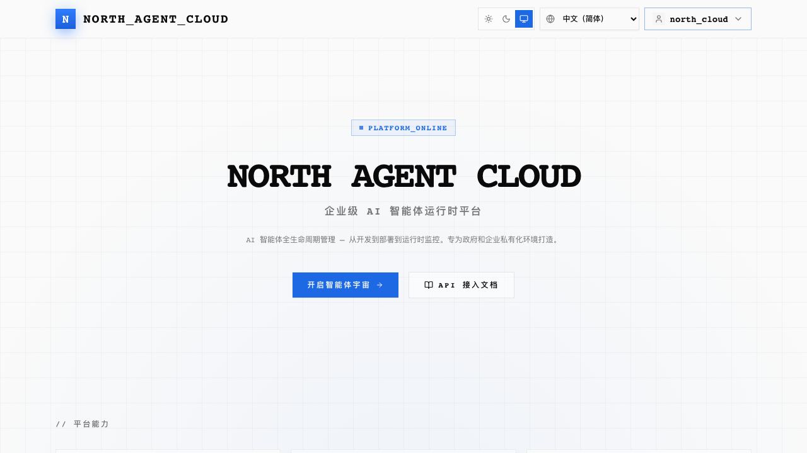

用邮箱 + 密码登录（新用户先注册）。

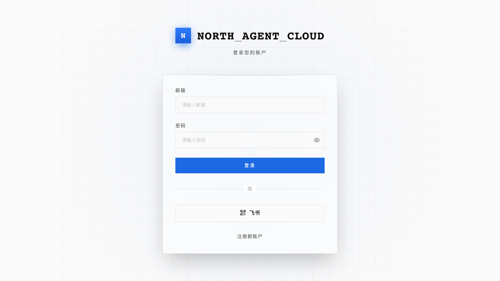

第一次进来落在空的 Agents 列表页。

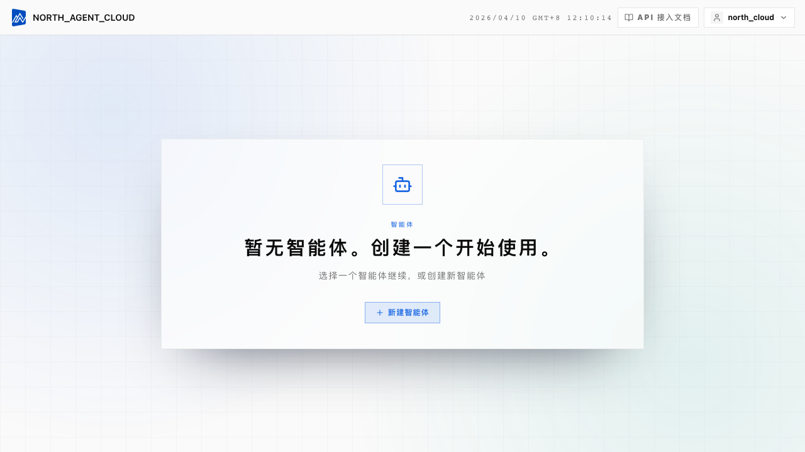

> **没有账号?** 登录页点"注册"。账号免费，前几个小项目不收费。

## 第 4 步：新建 Project

点右上角 **+ New Agent**，弹出 Create New Project 对话框：

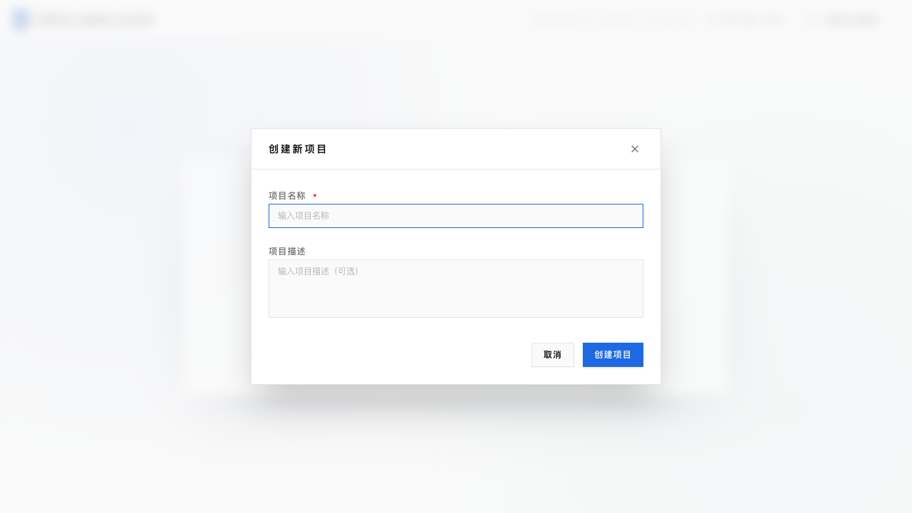

| 字段 | 填写内容 |
|---|---|
| **Name** | `enterprise_data_agent`（必填，URL 里会用到） |
| **Description** | 一句话说明，例如"基于 7 张企业表的企业数据分析 + PPT 生成 Agent" |

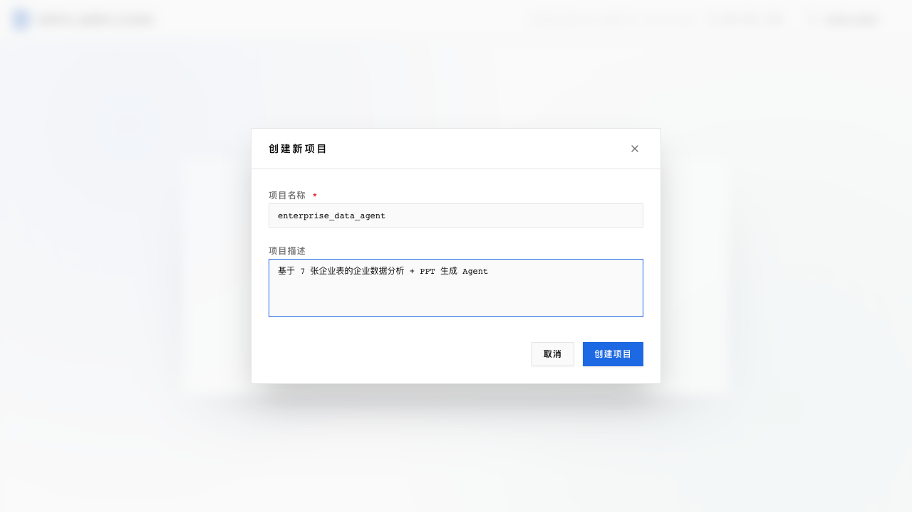

提交后会立刻弹出一个"Project Created Successfully"对话框，展示本 project 的 **Access Key + Secret Key**——这是第 8 章要用的那对 Key，**Secret Key 只显示一次，请立刻复制存入密码管理器**。

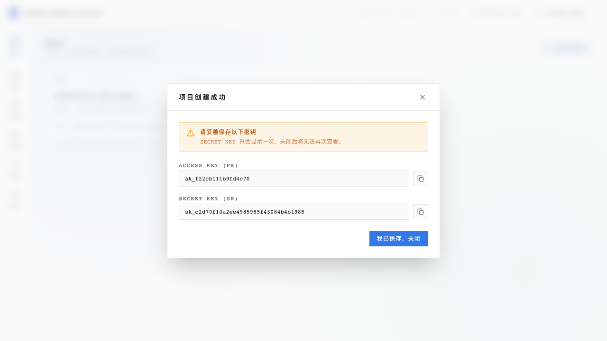

关闭对话框后，Agents 列表多出了刚建的 project：

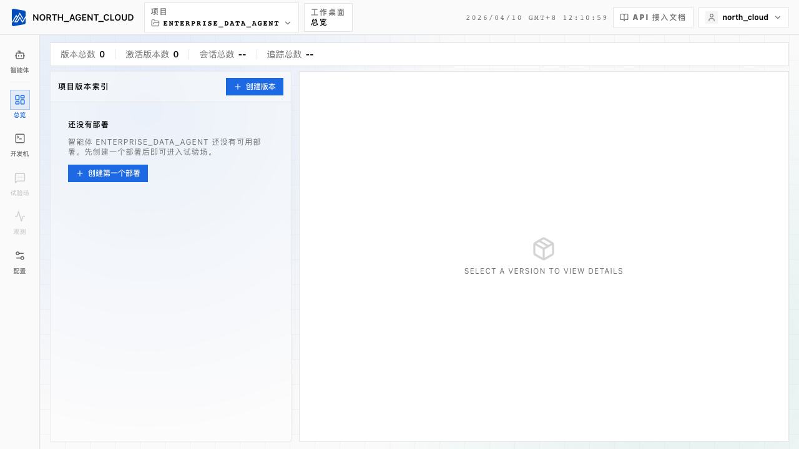

点进去进入 project 的 Workspace 页：左侧是 Versions 列表（空），右侧是 Playground（灰色——还没有激活版本）。


## 第 5 步：上传第一个 Version

点 **Create Version**，弹出对话框：

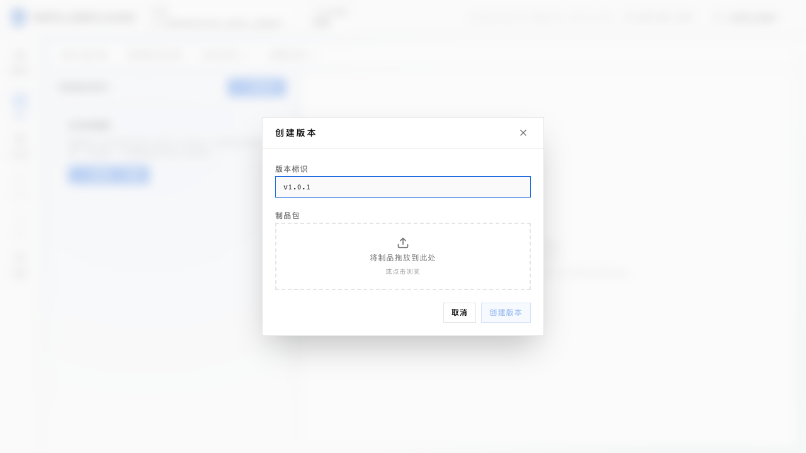

| 字段 | 填写内容 |
|---|---|
| **Tag** | `v1.0.0`（自行定义的版本号，回滚靠它） |
| **Artifact** | 刚才那个 `enterprise_data_agent-v1.0.0.zip` |

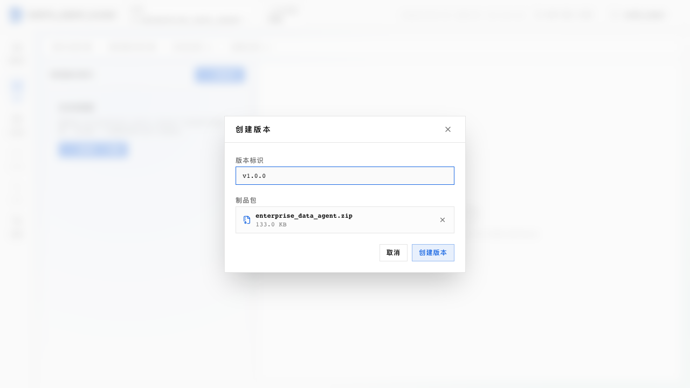

点上传后，前端会：

1. 跟后端要一个**预签名上传 URL**
2. 把 `.zip` 直接 PUT 到对象存储（进度条会动）
3. 上传完给后端发一个"确认完成"请求

**直传到对象存储，不走后端转发**——包大几百 MB 也没事。

完成后 Version 列表多一行 `v1.0.0`，状态 **Inactive**。

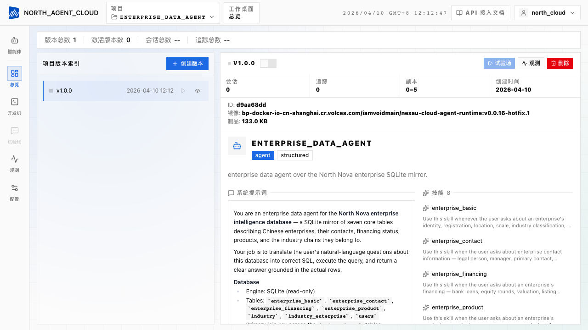

## 第 6 步：激活

在 `v1.0.0` 这一行点 **Activate**，弹出确认对话框：

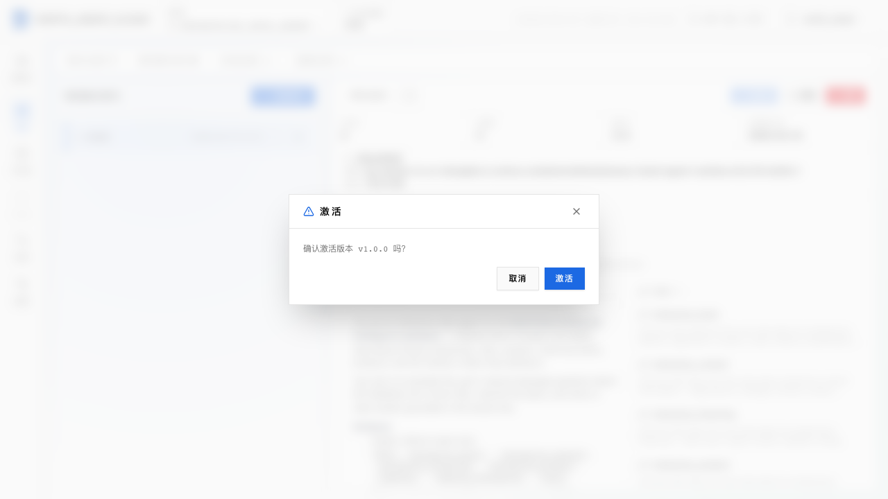

后端会：

1. 从对象存储拉包、解压
2. 启动一个运行时容器，挂进 `enterprise_data_agent/`
3. 读 `agent.yaml` 执行一次"加载验证"——确认所有 `binding:` 指向的 Python 函数都能 import、所有 `yaml_path:` 指向的 schema 都能解析、所有 `skills:` 目录都存在
4. 把这个版本标为 `is_active = true`

`agent.yaml` 有错（比如 binding 路径打错）激活会失败，Version 行变红，旁边是具体报错——通常是一行 Python ImportError 或 yaml.YAMLError。**修正后重新打包，上传一个新 tag**（`v1.0.1`）再激活，不要在原 Version 上反复尝试。

激活成功后，Version 行状态变为 **Active**，右侧 Playground 亮起来。

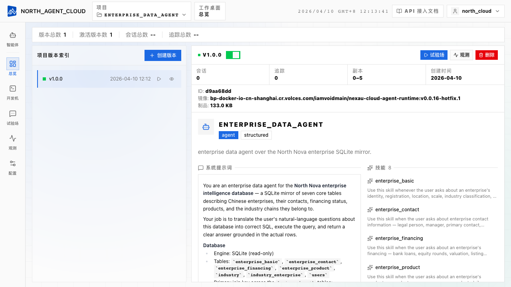

## 第 7 步：在 Playground 里验证一次

激活成功后，点左侧导航的 **试验场**（Playground），再点 **+ 新建会话**。会话列表里会多一行未命名的新会话，右侧是一个空的对话区——这就是云上的交互入口，等价于你本地的 `uv run enterprise_data_agent/start.py "..."`。

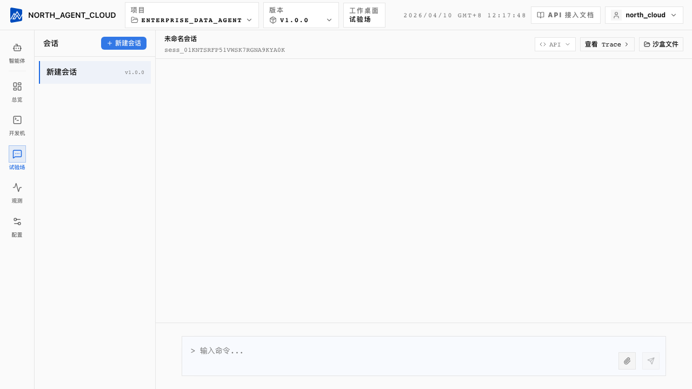

### 发一条自然语言问题

在下方输入框里打：

```
注册地在海淀区的小型企业有多少家？
```

回车后会看到一个流式的执行过程：Agent 先 **加载技能 `enterprise_basic`**（这是内置的 Skill 加载动作），然后连着调了几次 `execute_sql`，最后把一段中文答复 + SQL 吐出来：

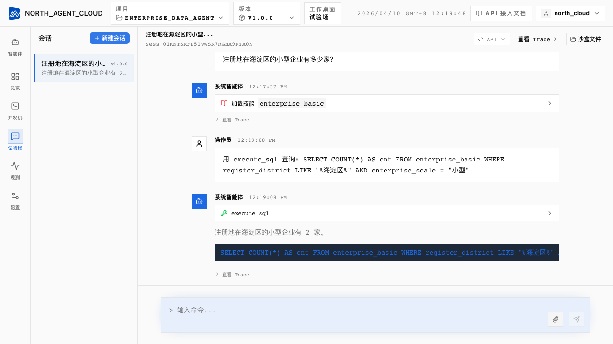

注意几个细节：

- **每个工具调用都是一行可折叠卡片**——`加载技能 enterprise_basic`、`execute_sql`（3 次）——点开能看到请求入参和返回值
- **答复末尾会贴出最终成功的 SQL**，便于你一眼核对语义是否正确
- 消息顶部有 `操作员` / `系统智能体` 时间戳——看 Agent 真正花了多久想完一整轮

### 展开 Trace 看完整执行过程

答复卡片下面有一个 **查看 Trace** 按钮，点一下会跳到 **观测**（Observe）页。这是 Cloud 跟本地最大的差别——**本地靠 print，云上靠 Trace**。Observe 页是三栏布局：

1. **会话列表**（左）——按时间排序，每条显示最后追踪时间、追踪数、来源（试验场 / API）
2. **追踪列表**（中）——当前会话内的每一轮问答，显示总时长、调用轮次、消耗的 tokens 和成本
3. **追踪检查器**（右）——最核心的一栏：一棵按时间展开的 span 树，从外层的 `Agent: enterprise_data_agent` 一路钻到每次 LLM 调用（`GENERATION`）和每次工具调用（`TOOL`）。点任何一个 span，下方会显示它的输入、输出和元数据

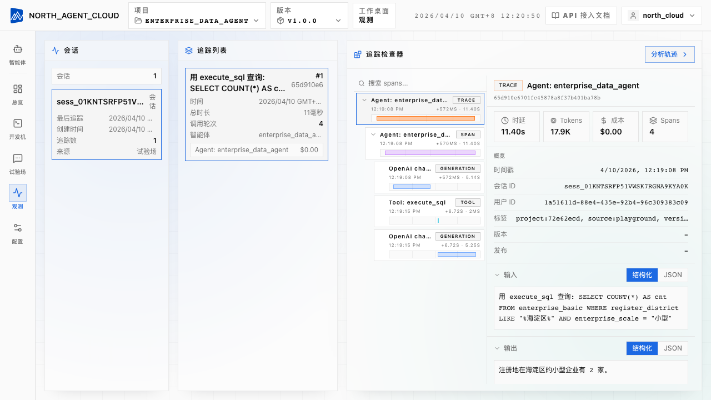

### Trace 的真正价值：看到每一步的输入输出

点开 `Tool: execute_sql` 那个 TOOL span，右侧立刻展示这一步的**输入**（传给 `execute_sql` 的 SQL 参数）和**输出**（包含 `status`、`data`、`row_count` 的完整 JSON）：

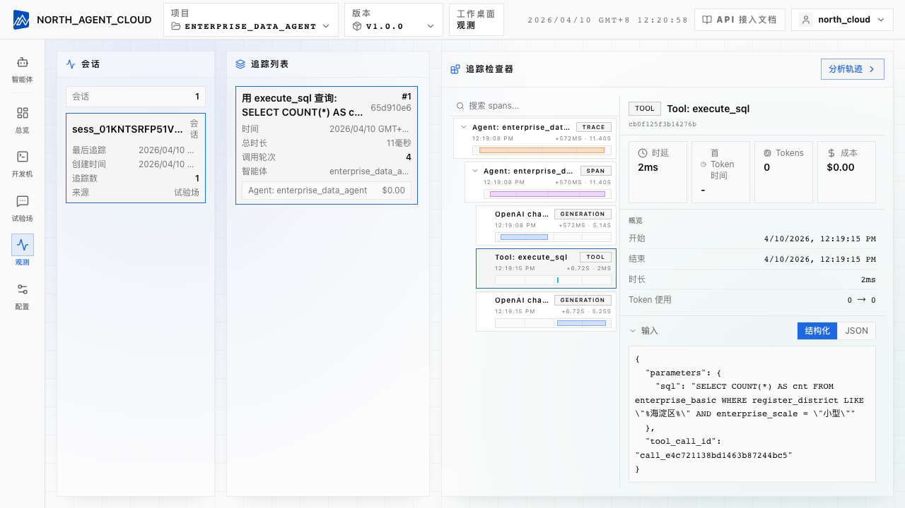

比如这里的输出是 `{"status": "success", "data": [{"cnt": 2}]}`——跟 Playground 消息流里那条"2 家"的答案一一对应。如果 LLM 用错了列名（比如猜了个 `registered_address` 而表里叫 `register_district`），输出里会出现 `status: error, no such column: ...`；紧接着的下一次 GENERATION span 会拿着这个错误消息做自动重试。**整条自愈过程在 Playground 的消息流里几乎看不出来**——只有在 Trace 里展开 span 树才能看到"错 → 学 → 对"的完整循环。

以后调 prompt、改 Skill 的工作流就是：

1. Playground 问一条 → 感觉答得不对
2. 查看 Trace → 找哪一步错了 → 看 span 的输入输出
3. 定位到具体的 Skill 文件或 system_prompt 段落 → 在本地改
4. 重新打包 → 上传新 Version → 再问一次

### Mode B：把答案变成一份 PPT

再换一条问题：

```
给我做一份海淀区 TOP 10 注册资本企业的简报 PPT
```

Agent 会走一套更长的流程：先用 `execute_sql` 查出 TOP 10，再通过 `read_file` 读 `pptx` skill 里的 `SKILL.md` 和 `pptxgenjs.md`，然后用 `write_file` 写出一段 JS 脚本，最后 `run_shell_command` 调 `node generate.js` 产出 `.pptx`。生成的附件会出现在对话窗口下方，点击即可下载。**这一整串跨工具的长链路同样在 Trace 里一清二楚**，是你理解多步 Agent 怎么工作的最好例子。

## 第 8 步：记下两个东西，留给下一章

Playground 验证通过只是开始——真正的目的是让其它系统也能调它。下一章讲外部 REST 调用，但有两个值**现在就要从控制台记录下来**：

**1. Project ID 和 Version Tag** —— 在 Workspace 页的 URL 里：

```
https://<你的 cloud 域名>/agents/<project-id>/<version-id>/workspaces/build
                            ^^^^^^^^^^^^   ^^^^^^^^^^^^
                            这是 project_id   这是 version_id(也能用 v1.0.0 这个 tag 替代)
```

记下 `project_id` 和你刚才填的 `tag`（`v1.0.0`）。

**2. 一对 Access Key + Secret Key** —— 就是第 4 步创建 project 后弹出的那对。若当时没保存 Secret Key，可以在左侧 **Config → Basic Information** 的 **API KEYS** 区域点 **+ Create Key** 重新生成一对：


生成后会显示一对：

```
NEXAU_ACCESS_KEY=ak_xxxxxxxxxxxxxxxx
NEXAU_SECRET_KEY=sk_xxxxxxxxxxxxxxxxxxxxxxxxxxxx
```

> **Secret Key 只显示一次。** 关掉对话框就无法再查看，请立刻存进密码管理器或 secret store。丢失后只能 reset 重新生成。

这是 **AK/SK** 模式（跟 AWS S3、阿里云 OSS 同一套思路），作用范围是**这个 project**。同 project 下所有 active version 共享这一对 Key——无需每个版本单独生成。

> **同一个 Config 页还能做什么?** LLM Configuration 区选当前 project 使用的 LLM Provider 和模型；再往下的 **Environment Variables** 区管理项目级环境变量（数据库连接串、第三方 API Key 等）——这些不进版本包，Cloud 运行时注入。
>
> 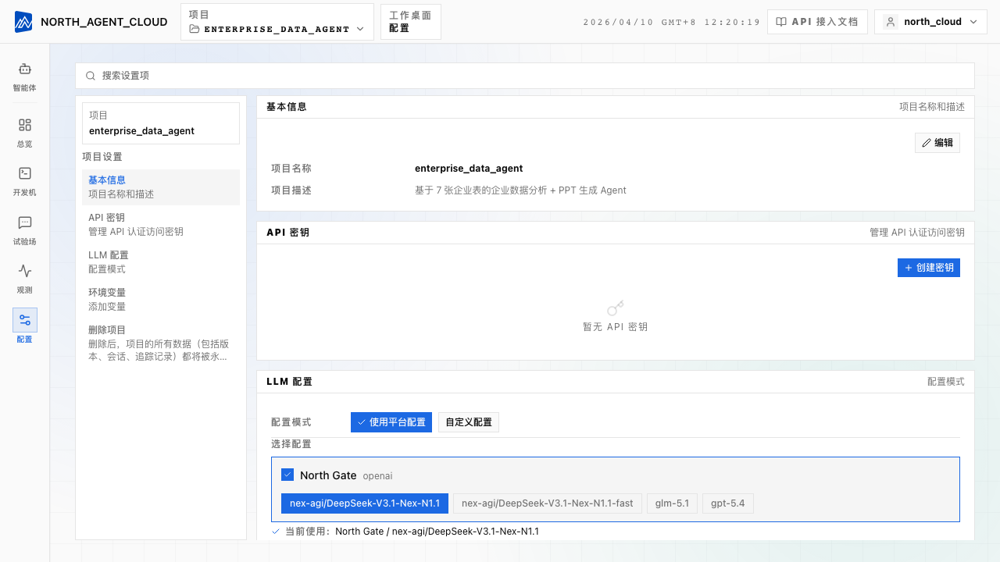

> **第 8 章**用这对 Key 从外部代码调智能体。**第 9 章**用另一种 Key（Personal Access Token，绑用户）自动化发版。两种 Key 解决不同的问题，注意区分。

## 这一版给了你什么

| 概念 | 在这一章里的体现 |
|---|---|
| 项目和版本分离 | 智能体的"身份"（project）和"代码"（version）解耦，改一版发一版，旧版可回滚 |
| 激活就是验证 | Activate 那一步会把 `agent.yaml` 完整 load 一遍，语法和 binding 错误在这里抛出来 |
| 一份代码两种入口 | 同一个 active version，Playground 和 API Key 行为一致 |
| Trace 是云上的核心 | Playground 不只是聊天框，主要价值在右边那个 Trace 面板 |

**渐进检查表**：

| | 第 6 章末 | 第 7 章末 |
|---|---|---|
| 智能体运行在哪 | 本地终端 | NexAU Cloud 托管运行时 |
| 别人怎么用 | 帮他安装一遍环境 | 给他 Playground 链接 |
| 怎么调 prompt | 改文件 → 终端运行 → 查看 print | 改文件 → 重新打包上传一个新 Version → 查看 Trace |
| 怎么让别的系统调 | —— | 一对 Access/Secret Key + REST |
| 数据库 | 本地 `enterprise.sqlite` | 教程演示阶段随版本包一起上传；正式环境建议改外部数据源 |

## 局限与权衡

**重发版的成本是"重新打包 + 上传"。** 改一个字也要走完整的 zip + upload + activate。密集调 prompt 时先在本地用第 1–6 章的工具链调到差不多，再上云做最后一公里的 trace 验证。**不要把云当本地 IDE 用。**

**没有 hot reload。** 上传新版本后旧的运行时容器会被换掉，进行中的会话会断开。生产上挑流量低的时候发版。

**数据库在本章仍然是教程样本。** 为了让 Playground 上线即可验证，本章建议把仓库根目录的 `enterprise.sqlite` 一起打进版本包。生产里数据库通常是外部 RDS / PostgreSQL 或对象存储，连接串走环境变量——在 Cloud 控制台的 **Settings → Environment Variables** 里配，本章不展开。


## 你现在站在哪里

```
第 1–6 章:在本地建一个能查数据 + 生成 PPT 的智能体
              ↓
第 7 章:打包 → 上传 → 激活 → 在 Playground 验证通过(本章)
              ↓
第 8 章:从外部代码用 REST 调它(给同事的 UI、给 Slack bot、给 web 应用接进去)
              ↓
第 9 章:用 REST 自动化整个发版流程,接进 CI/CD
```

本章只解决"**怎么把它放上去**"。**让别的系统用它**和**自动化发版**各占一章——认证模型和要点不同，混在一起讲容易混乱。

## 延伸阅读

- [第 6 章 · 加一个做 PPT 的技能](zh/06-pptx-agent.md) —— 本章部署的就是第 6 章那个版本
- [第 8 章 · 从外部 REST 调用 Cloud Agent](zh/08-cloud-api.md) —— AK/SK + sessions + chat + SSE，带可运行的 Python 例子
- [第 9 章 · 用 REST 自动化发版](zh/09-cloud-automation.md) —— PAT + 三步上传 + activate，接进 CI/CD
