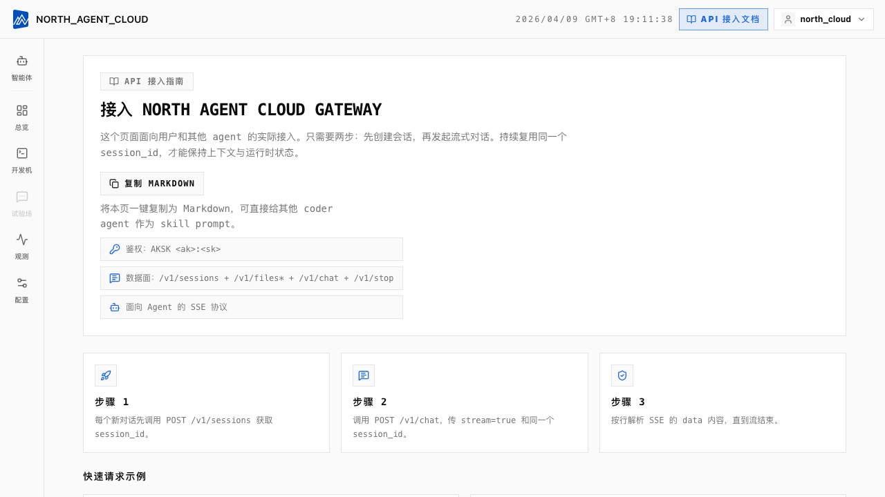

# 第 8 章 · 从外部 REST 调用 Cloud Agent

**TL;DR**：用第 7 章获取的 Access Key + Secret Key，通过 `Authorization: Basic base64(ak:sk)` 调 Agent Gateway 的两个端点——`POST /agent-api/sessions` 获取 `session_id`，`POST /agent-api/chat` 发消息获取 SSE（Server-Sent Events，服务端单向推送事件的 HTTP 协议）流。**没有 SDK，就是普通 HTTP**，任何能发请求的语言都能接。

> **本章假设**你已经走完第 7 章，在 Cloud 上有一个激活版本和一对 AK/SK。若尚未完成，请先回到[第 7 章](zh/07-deploy-cloud.md)。

## 最终成果

一段不到 80 行的 Python，从命令行问云上的智能体任何问题：

```bash
$ python call_agent.py "注册地在海淀区的小型企业有多少家?"
[reasoning] 我需要先看 enterprise_basic 表的 register_district 列...
[tool_call] execute_sql(sql="SELECT COUNT(*) FROM enterprise_basic WHERE register_district = '海淀区' AND enterprise_scale = '小型'")
[tool_result] [{"count": 2}]
[answer] 注册地在海淀区的小型企业共有 2 家。

SQL: SELECT COUNT(*) FROM enterprise_basic WHERE register_district = '海淀区' AND enterprise_scale = '小型'
```

把这段代码加入 web 后端、Slack bot、企业微信回调或一个 cron job，智能体就在产品中运行起来了。

## 两个 API 端点，加一个端口

Cloud 内部分两个服务：

| 服务 | 用途 | 访问方式 | 认证 |
|---|---|---|---|
| **Backend**（控制平面） | 建项目、发版本、改 env vars、查看历史 trace | `https://<cloud-host>/api/*` | JWT cookie（浏览器）或 PAT（自动化，第 9 章） |
| **Agent Gateway**（数据平面） | 与正在运行的 agent 通信（sessions / chat / stop / files） | `https://<gateway-host>/agent-api/*` | **AK/SK Basic auth**（本章主角） |

> **gateway-host 在哪?** 自托管通常是 `gateway.<你的域名>`，或跟 backend 同域不同 path。SaaS 在 **Settings → API Endpoints** 页有完整 URL。本章用 `https://gateway.nexau.example` 占位，运行代码前替换成你自己的。

## 思路

调用流程**只有两个 HTTP 请求**：

```
1. POST /agent-api/sessions   →  拿 session_id
                                       ↓
2. POST /agent-api/chat       →  SSE 流回来一堆 NexAU 事件
   (带 session_id + version_tag + messages)
```

为什么要先建 session?因为 NexAU 的 agent 是有状态的——一次会话对应一个**沙箱（sandbox）**，里面有工作目录、临时文件、上下文。`session_id` 就是这个沙箱的句柄。同一个 session 多次 chat 状态保留，不同 session 互相隔离。

> **session 跨版本。** 第 7 章激活了 `v1.0.0`，之后改 prompt 发 `v1.0.1`，旧 session 仍然有效——下次 chat 指定新的 `version_tag`，session 会切到新版本继续运行。设计意图：session 绑用户（distinct_id），不绑代码版本。

## 第 1 步：认证格式

AK/SK 走标准的 HTTP Basic Auth：

```
Authorization: Basic <base64(access_key + ":" + secret_key)>
```

Python 的 `requests` 直接 `auth=(ak, sk)` 就会拼好。`curl` 用 `-u ak:sk`。

> **不要用 `Authorization: Bearer`、`X-Access-Key` 这类自定义头。** Agent Gateway 只认 `Basic`（和一个为了向后兼容的 `AKSK ak:sk`），其它格式直接 401。

## 第 2 步：建一个 session

最小请求：

```bash
curl -u "$NEXAU_ACCESS_KEY:$NEXAU_SECRET_KEY" \
     -H "Content-Type: application/json" \
     -d '{"distinct_id": "user-1234"}' \
     https://gateway.nexau.example/agent-api/sessions
```

请求体只有一个字段：

| 字段 | 类型 | 说明 |
|---|---|---|
| `distinct_id` | string | **你这边的最终用户 ID**——登录用户的 UUID、邮箱 hash、客户 ID，任何能区分"是哪个真人"的标识。会进 Langfuse trace 按用户聚合 |

> **`project_id` 不在请求体里。** AK/SK 已经唯一确定了 project，服务端验证完 AK/SK 就知道是哪个 project。session 跟 version 解耦，project 由 AK/SK 隐式绑定。

返回：

```json
{
  "session_id": "sess_01HXXXXX",
  "created_at": "2026-04-07T12:34:56Z"
}
```

记下 `session_id`，接下来发 chat 要用。

## 第 3 步：发 chat

```bash
curl -u "$NEXAU_ACCESS_KEY:$NEXAU_SECRET_KEY" \
     -H "Content-Type: application/json" \
     -H "Accept: text/event-stream" \
     -d '{
       "session_id": "sess_01HXXXXX",
       "distinct_id": "user-1234",
       "version_tag": "v1.0.0",
       "messages": [
         {"role": "user", "content": "注册地在海淀区的小型企业有多少家?"}
       ],
       "stream": true,
       "source": "user"
     }' \
     https://gateway.nexau.example/agent-api/chat
```

请求体的核心字段：

| 字段 | 必填 | 说明 |
|---|---|---|
| `session_id` | ✅ | 上一步获取的 |
| `distinct_id` | ✅ | 跟 session 那一步一致 |
| `version_tag` | ✅（或 `version_id`） | 打到哪个版本——**强烈推荐用 tag**（`v1.0.0`），不要用 UUID。换版本只改这个字段，代码不动 |
| `messages` | ✅ | 跟 OpenAI 一样的 `[{role, content}]` 数组，亦可直接传一个字符串 |
| `stream` | ❌（默认 true） | true 走 SSE，false 一次性返回 JSON |
| `source` | ❌ | `"user"`（默认）或 `"playground"`，给 trace 打标用 |
| `agent` | ❌ | 多 agent 项目里指定哪个 agent。第 1–7 章只有一个，无需填写 |

> **为什么 `version_tag` 不在 session 里而在 chat 里?** session 和 version 解耦：同一个 session 可以先打 `v1.0.0` 运行几轮，再切到 `v1.0.1`（灰度对比）。session 是沙箱句柄，version 是代码句柄，生命周期不同。

## 第 4 步：解析 SSE 流

返回的 `Content-Type` 是 `text/event-stream`，每行是一个 SSE 事件：

```
data: {"type":"RUN_STARTED","run_id":"run_xxx"}

data: {"type":"TEXT_MESSAGE_CONTENT","delta":"我先看一下 enterprise_basic 表..."}

data: {"type":"TOOL_CALL_START","tool_call_name":"execute_sql","tool_call_id":"call_1"}

data: {"type":"TOOL_CALL_ARGS","delta":"{\"sql\":\"SELECT COUNT(*) FROM enterprise_basic..."}

data: {"type":"TOOL_CALL_END","tool_call_id":"call_1"}

data: {"type":"TOOL_CALL_RESULT","tool_call_id":"call_1","content":"[{\"count\": 2}]"}

data: {"type":"TEXT_MESSAGE_CONTENT","delta":"注册地在海淀区的小型企业共有 2 家..."}

data: {"type":"RUN_FINISHED","run_id":"run_xxx"}

data: [DONE]
```

每个事件是一行 `data: <json>`，行之间空行分隔（标准 SSE）。最后一行 `data: [DONE]` 表示流结束，收到即可关闭连接。

**主要事件类型**：

| 类型 | 含义 |
|---|---|
| `RUN_STARTED` / `RUN_FINISHED` / `RUN_ERROR` | 一次 run 的生命周期 |
| `TEXT_MESSAGE_CONTENT` | LLM 的文字回复增量，字段 `delta` |
| `TEXT_MESSAGE_END` | 一段文字结束 |
| `REASONING_CONTENT` | o1 / DeepSeek-R1 这类模型的思考过程，字段 `delta` |
| `TOOL_CALL_START` / `TOOL_CALL_ARGS` / `TOOL_CALL_END` | 工具调用，参数也是分块流式给的 |
| `TOOL_CALL_RESULT` | 工具返回的结果 |
| `IMAGE_MESSAGE` | 模型返回了一张图 |

> **完整事件清单**在 `services/agent-runtime/.../events.py`（自托管直接查看代码），或 Cloud 控制台右上角 **API DOCS** 按钮打开的文档页——里面有完整的事件类型图和字段说明。**90% 的应用只用 `TEXT_MESSAGE_CONTENT`**——delta 拼起来就是给用户看的回复，其它事件用来做 UI 动效（比如显示"正在调用工具…"）。
>
> 

## 第 5 步：把它写成一段 Python

```python
# call_agent.py
import json
import os
import sys

import requests

GATEWAY = os.environ["NEXAU_GATEWAY_URL"]      # https://gateway.nexau.example
AK = os.environ["NEXAU_ACCESS_KEY"]
SK = os.environ["NEXAU_SECRET_KEY"]
VERSION_TAG = os.environ.get("NEXAU_VERSION_TAG", "v1.0.0")
DISTINCT_ID = os.environ.get("NEXAU_DISTINCT_ID", "cli-user")


def create_session() -> str:
    resp = requests.post(
        f"{GATEWAY}/agent-api/sessions",
        auth=(AK, SK),
        json={"distinct_id": DISTINCT_ID},
        timeout=10,
    )
    resp.raise_for_status()
    return resp.json()["session_id"]


def chat(session_id: str, question: str) -> None:
    resp = requests.post(
        f"{GATEWAY}/agent-api/chat",
        auth=(AK, SK),
        headers={"Accept": "text/event-stream"},
        json={
            "session_id": session_id,
            "distinct_id": DISTINCT_ID,
            "version_tag": VERSION_TAG,
            "messages": [{"role": "user", "content": question}],
            "stream": True,
            "source": "user",
        },
        stream=True,
        timeout=300,
    )
    resp.raise_for_status()

    for raw in resp.iter_lines(decode_unicode=True):
        if not raw or not raw.startswith("data:"):
            continue
        data = raw[5:].strip()
        if data == "[DONE]":
            break
        event = json.loads(data)
        handle_event(event)


def handle_event(event: dict) -> None:
    etype = event.get("type", "")

    if etype == "TEXT_MESSAGE_CONTENT":
        # 把每个 delta 拼起来就是最终回复
        sys.stdout.write(event.get("delta", ""))
        sys.stdout.flush()

    elif etype == "TOOL_CALL_START":
        print(f"\n[tool_call] {event.get('tool_call_name')}", flush=True)

    elif etype == "TOOL_CALL_RESULT":
        content = event.get("content", "")
        preview = content[:80] + ("…" if len(content) > 80 else "")
        print(f"[tool_result] {preview}", flush=True)

    elif etype == "RUN_ERROR":
        print(f"\n[error] {event.get('message')}", file=sys.stderr)


if __name__ == "__main__":
    if len(sys.argv) < 2:
        print("用法: python call_agent.py '你的问题'", file=sys.stderr)
        sys.exit(1)

    sid = create_session()
    chat(sid, sys.argv[1])
    print()  # 收尾换行
```

运行：

```bash
export NEXAU_GATEWAY_URL="https://gateway.nexau.example"
export NEXAU_ACCESS_KEY="ak_xxxxx"
export NEXAU_SECRET_KEY="sk_xxxxx"
export NEXAU_VERSION_TAG="v1.0.0"

python call_agent.py "注册地在海淀区的小型企业有多少家?"
```

**就这些。** 不到 80 行便将第 1–7 章那个智能体接进了任何能安装 Python 的环境。换成 Node.js / Go / Rust 是同一回事——只是换个 SSE 解析库。

## 进阶：停一个失控的 run

用户发了个会执行 5 分钟的查询，前端按"取消"——你需要主动停掉这个 run：

```bash
curl -u "$NEXAU_ACCESS_KEY:$NEXAU_SECRET_KEY" \
     -H "Content-Type: application/json" \
     -d '{
       "session_id": "sess_01HXXXXX",
       "distinct_id": "user-1234",
       "version_tag": "v1.0.0",
       "force": true
     }' \
     https://gateway.nexau.example/agent-api/stop
```

返回 `{"status": "success"}` 就是停成功了，`"noop"` 表示当前 session 没有正在运行的 run。

## 进阶：给沙箱传文件

用户要上传 CSV 让 agent 分析，走 `multipart/form-data`：

```bash
curl -u "$NEXAU_ACCESS_KEY:$NEXAU_SECRET_KEY" \
     -F "session_id=sess_01HXXXXX" \
     -F "file=@./local_data.csv" \
     "https://gateway.nexau.example/agent-api/files?project_id=<pid>&version_id=<vid>&distinct_id=user-1234&source=user"
```

返回里的 `path` 是文件在 sandbox 里的绝对路径。把它传入下一次 chat 的 message（比如"分析一下 `/sandbox/uploads/local_data.csv`"），agent 就能读到。

> 另外还有 `/agent-api/files/list` 和 `/agent-api/files/delete`，语义如名，这里不展开。

## 这一版给了你什么

| 概念 | 在这一章里的体现 |
|---|---|
| 控制平面 vs 数据平面 | Backend（`/api/*`）管发版和元数据，Gateway（`/agent-api/*`）管运行时调用——两个端口、两套认证 |
| AK/SK 是 project-scoped | 一对 Key 等于"有权调这个 project 的所有 active version" |
| Session 跟 version 解耦 | 同一个 session 能跨版本切换——灰度发布的基础 |
| SSE 是默认通道 | 90% 的事件只需要拼 `TEXT_MESSAGE_CONTENT`，其它给 UI 动效 |
| `distinct_id` 是 trace 聚合的钥匙 | 提供越准确，Langfuse / 控制台按用户筛 trace 越好用 |

## 局限与权衡

**SSE 不是 WebSocket。** 它是单向的（server → client），客户端不能"在 chat 运行到一半补一句"。双向交互的做法是：agent 运行完一轮交还控制权，客户端拿下一句话再发一次 chat，带同一个 `session_id`。

**没有官方 SDK**（写本章时）。所有调用都是手写 HTTP——好处是任何语言都能接，坏处是事件类型、认证 header、错误处理都得自己实现。多语言团队**优先在 backend 写一个 thin wrapper，前端只调自己的 wrapper**，比每个客户端都直接对着 Gateway 强。

**`distinct_id` 不能为空。** Gateway 直接 400。产品允许匿名用户的话，传入一个 `"anonymous-<short uuid>"`，不要留空字符串。

**版本切换不是原子的。** `version_tag` 从 `v1.0.0` 改成 `v1.0.1` 之后，新 chat 请求会路由到新版本，但**旧版本的运行时容器不会立刻回收**——要等空闲超时。发版后的几分钟内，同一个 session 的两次连续 chat 理论上可能打到不同容器实例（版本一致）。若 agent 在 sandbox 里写了不持久化的临时状态，这一点需要留意。

## 接下来

第 7、8 章解决了"**人用**"和"**别的系统用**"。还差一件——**自动发版**。每次改完 prompt 都打开浏览器拖文件，并非工程化的做法。

[第 9 章](zh/09-cloud-automation.md)讲用 PAT 从命令行或 CI 走完"build zip → 创建 version → 上传 artifact → activate"全过程，接进 GitHub Actions 几十行 yaml 即可。

## 延伸阅读

- [第 7 章 · 部署到 NexAU Cloud](zh/07-deploy-cloud.md) —— 获取 AK/SK 的地方
- [第 9 章 · 用 REST 自动化发版](zh/09-cloud-automation.md) —— 把发版接进 CI/CD
